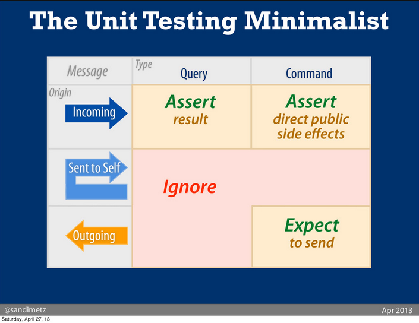

Notes:

- What an object does is a lot more important that what it is.

- Test the messages, not the implementation.

- Break rules if it saves $$$$

- Messages can be of two kinds or both:
  * Query => Return a value. It does not have a side effect. Example 2 + 2
  * Command => Has a side effect, but returns nothing. Example, save to the database.
  * Both. Example Array pop.

- It can be dangerous to write a message that is both a command and query. (Although, we do, and sometimes have to
  conflate both types of messages)

- Incoming query is tested by asserting the result.

- Incoming command is tested, by asserting the direct public side effect.

- It is not required to test messages to self. (They get tested while testing public messages).

- It is not required to test outgoing query messages. They are tested as a part of incoming messages of receiver. An
  outgoing query message (no side effects), is invisible to the rest of the app.

- Since outgoing commands cause side-effects, they should be tested. (The side effect is publicly visible). Although,
  do not test the side effect per say.  Mock the receiving object, and test that the outgoing message was sent
  correctly!. If the side effect is close, and in-expensive to test, test the side-effect.

- Use tools that make sure mocks are in sync with the implemented api, to avoid making your tests return false
  positives.

References:
- All notes taken from Sandi Metz' talk: https://www.youtube.com/watch?v=URSWYvyc42M
